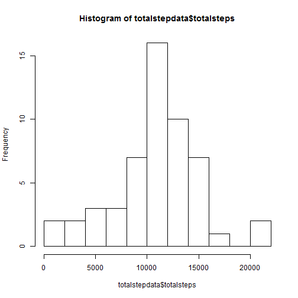
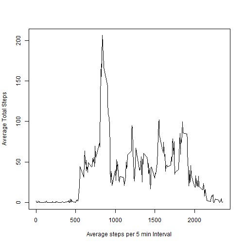
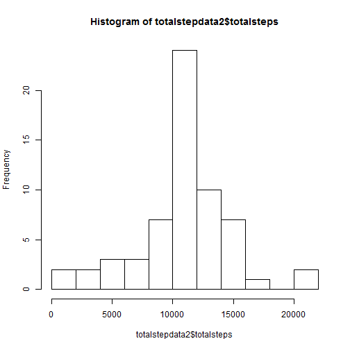
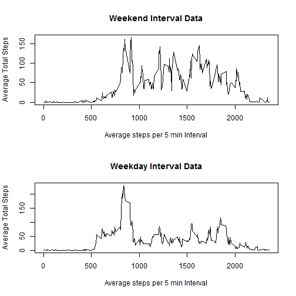

# Nathan's Peer Assessment 1 for Coursea.


## Loading and preprocessing the data

```r
setwd("C:/Users/Brian/Documents/COURSERA/class4week2")

dataset<-read.csv("activity.csv")
#dataset$date<-as.Date(dataset$date)
dataset2<-na.omit(dataset)
```

Note all markdown templates we're forked from Dr. Pengs Github account and edited per the directions.
Note: i technically downloaded the zip - and unzipped it in a working directory...yeha i know not super slick.

## What is mean total number of steps taken per day?
### Calculate the total number of steps taken per day

Here is some sample output. I have found the total number of step per day. Cool.


```r
library(dplyr)
dataset2<-tbl_df(dataset2)
totalstepdata<-dataset2 %>% group_by(date) %>% summarise(totalsteps<-sum(as.numeric(steps)))
print(head(totalstepdata))
```

```
## Source: local data frame [6 x 2]
## 
##         date totalsteps <- sum(as.numeric(steps))
## 1 2012-10-02                                  126
## 2 2012-10-03                                11352
## 3 2012-10-04                                12116
## 4 2012-10-05                                13294
## 5 2012-10-06                                15420
## 6 2012-10-07                                11015
```

### Make a histogram of the total number of steps taken each day
I will use a histogram to see the distribution of daily total steps. Wow.


```r
hist(totalstepdata$totalsteps,breaks=10)
```

 
This appears to be faily normal with 10 bins...right on.

### Calculate and report the mean and median of the total number of steps taken per day

```r
stepmean<-mean(totalstepdata$totalsteps)
stepmedian<-median(totalstepdata$totalsteps)
```

The mean number of total steps per day is 10766.19.
The median number of total steps per day is 10765.
These are pretty close....DAMN!

## What is the average daily activity pattern?

### Make a time series plot (i.e. type = "l") of the 5-minute interval (x-axis) and the average number of steps taken, averaged across all days (y-axis)
For this problem I found the average total steps per 5 min interval and made a plot.


```r
dataset2$date<-as.Date(dataset2$date)


meanstepdata<-dataset2 %>% group_by(interval) %>% summarise(totalsteps<-mean(steps))
plot(meanstepdata$interval,meanstepdata$totalsteps,typ="l", xlab="Average steps per 5 min Interval",ylab="Average Total Steps")
```

 

### Which 5-minute interval, on average across all the days in the dataset, contains the maximum number of steps?

```r
maxinterval<-meanstepdata[meanstepdata$totalsteps==max(meanstepdata$totalsteps),"interval"]
```
On average, the interval 835 contains the the maximum number of steps.


## Imputing missing values
### Calculate and report the total number of missing values in the dataset (i.e. the total number of rows with NAs)
i need to use my original dataset - not dataset2.

```r
missingvals<-sum(is.na(dataset$steps))
```

The number of missing values is: 2304.


### Devise a strategy for filling in all of the missing values in the dataset. The strategy does not need to be sophisticated. For example, you could use the mean/median for that day, or the mean for that 5-minute interval, etc.

Ok - so we're going to follow one of the simple strategies mentioned by Dr. Peng.
We're going to use the average interval step count for all missing values.


### Create a new dataset that is equal to the original dataset but with the missing data filled in.

```r
completedata <- transform(dataset, steps = ifelse(is.na(dataset$steps), meanstepdata$totalsteps[match(dataset$interval, meanstepdata$interval)], dataset$steps))
```
This dataset contains imputed missing values.


### Make a histogram of the total number of steps taken each day and Calculate and report the mean and median total number of steps taken per day. 


Here is a new historgram with the new (completedata) data set.

```r
hist(totalstepdata2$totalsteps,breaks=10)
```

 

```r
stepmean2<-mean(totalstepdata2$totalsteps)
stepmedian2<-median(totalstepdata2$totalsteps)
```
The mean number of the imputed total steps per day is 10766.19.
The median number of the imputed total steps per day is 10766.19.


### Do these values differ from the estimates from the first part of the assignment? 


```r
diffmean<-stepmean-stepmean2
diffmed<-stepmedian-stepmedian2
```

The difference in the mean is 0. 
The difference in the median is -1.1886792.
There is very little difference.

### What is the impact of imputing missing data on the estimates of the total daily number of steps?
By using the averages - we're essential doubling up data so the overage averages will still remain constant. Our stragetgy had little impact on the overall mean of the data. The st. dev. will be reduced, since we do not have as much variance around the mean.


## Are there differences in activity patterns between weekdays and weekends?
### Create a new factor variable in the dataset with two levels <U+0096> <U+0093>weekday<U+0094> and <U+0093>weekend<U+0094> indicating whether a given date is a weekday or weekend day.
Not a problem. see below. I'm using the imputed data because  - why not - there appears to be no specific directions for this.

```r
completedata$day<-weekdays(as.Date(dataset$date))

for( i in 1:dim(completedata)[1])
{
if(completedata$day[i] %in% c("Saturday","Sunday"))(completedata$weekend[i]<-1)else{completedata$weekend[i]<-0}
}
```

### Make a panel plot containing a time series plot (i.e. type = "l") of the 5-minute interval (x-axis) and the average number of steps taken, averaged across all weekday days or weekend days (y-axis).
Why the hell not...lets build this on the data from the previous section.


```r
weekenddata<-completedata[completedata$weekend==1,]
weekdaydata<-completedata[completedata$weekend==0,]

meanstepdataWE<-weekenddata %>% group_by(interval) %>% summarise(totalstepsWE=mean(steps))
meanstepdataWD<-weekdaydata %>% group_by(interval) %>% summarise(totalstepsWD=mean(steps))

par(mfrow=c(2,1))
plot(meanstepdataWE$interval,meanstepdataWE$totalsteps,typ="l", main="Weekend Interval Data", xlab="Average steps per 5 min Interval",ylab="Average Total Steps")
plot(meanstepdataWD$interval,meanstepdataWD$totalsteps,typ="l", main="Weekday Interval Data", xlab="Average steps per 5 min Interval",ylab="Average Total Steps")
```

 

That plot is hot.

Thanks for enjoying.

Nathan
